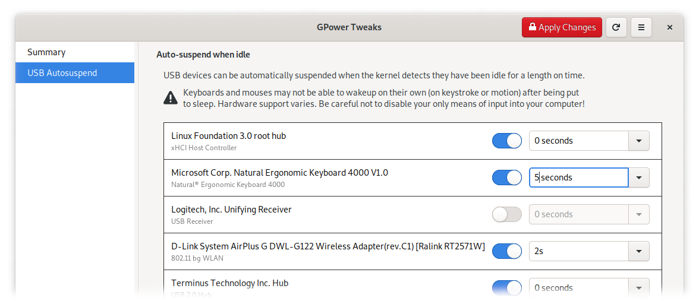

# GPower Tweaks
Tweak linux power management settings

- [x] Change USB autosuspend settings (on/off and idle delay)
- [ ] Change whether an USB device can wake itself up
- [ ] USB Port power control
  - `pm_qos_no_power_off`
  - show connection type (hardwired/hotplug/...)
  - warn if child devices are not set to autosuspend anyway
- [x] PCI power management (autosuspend on/off, idle delay)
- [ ] PCI wakeup support



## Install

GPower Tweaks is build with meson and requires the following to build:

- [Rust 1.43 or later][1]
- GTK 3.22 or later  (`gtk3-devel` on RHEL/Fedora, `libgtk-3-dev` on Debian/Ubuntu)
- Meson build system

GPower Tweaks requires the following to run:

- GTK 3.22 or later
- PolicyKit
- Gvfs

Install it from source with:

```sh
$ git clone https://github.com/gourlaysama/gpower-tweaks
$ cd gpower-tweaks
$ meson --prefix=/usr build
$ sudo ninja -C build install
```

#### License

<sub>
GPower Tweaks is licensed under the <a href="LICENSE">Apache License, Version 2.0</a>.
</sub>

<br>

<sub>
Unless you explicitly state otherwise, any contribution intentionally submitted
for inclusion in GPower Tweaks by you, as defined in the Apache-2.0 license, shall be
licensed as above, without any additional terms or conditions.
</sub>

[1]: https://www.rust-lang.org/tools/install